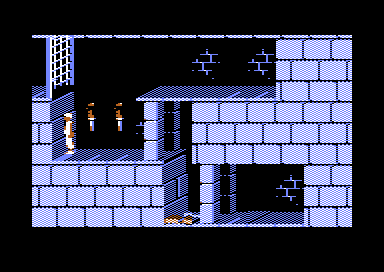
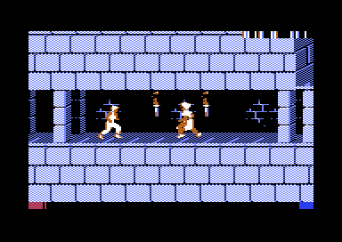
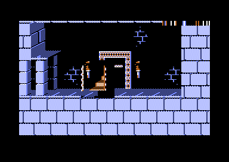
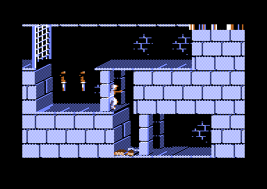
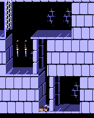

# Prince of Persia — Commodore 64

A port of the classic **Prince of Persia** (Apple II, 1989, Jordan Mechner)
to the Commodore 64, written in 6502 assembly and driven by the **original
game data**: the levels, animation bytecode, and frame tables are the exact
bytes Jordan Mechner shipped in 1989, and the graphics are decoded straight
from the original Apple II image tables.

It is a sister project of [PrinceOfPersiaPy](https://github.com/ulasb/PrinceOfPersiaPy),
a faithful Python reimplementation that serves as the readable spec and
behavioral ground truth for this port.



## Status: Level 1 playable start to finish — guards included

Level 1 renders and plays with a joystick — from the opening drop out of
the entrance gate to climbing the exit stairs:

- **Room rendering** from the original 2304-byte level blueprints, using the
  original BGDATA piece tables and the original drawing model (each block
  draws the C/B/A/D image sections of itself and its neighbours)
- **Authentic animation**: the original SEQTABLE bytecode runs in a small
  6502 interpreter; FRAMEDEF maps every frame to the original sprite images
  including per-frame movement deltas, so the rotoscoped feel survives
- **Movement**: running, turning, standing and running jumps, careful steps,
  crouching, climbing up and down, hanging from ledges, mid-air ledge grabs,
  falling with the original damage thresholds, wall and gate collision —
  including Level 1's iconic opening drop out of the entrance gate
- **Swordplay**: guards spawn from the level data with the original
  skill-based AI (engage, advance, retreat, strike, reactive block), the
  kid fights back with the full engarde move set — strikes, parries,
  ripostes, sheathing — resolved with the original strike/block frame
  rules; sword pickup works, both fighters' health shows as hearts
- **Tile machinery**: loose floors that shake, break and fall as debris,
  pressure plates driving gates and the exit door through the original
  LINKLOC/LINKMAP wiring, gates that rise/slam with the original state
  machine, the sliding exit door, and finishing the level up the stairs;
  death or victory restores the level from a first-touch mutation log
- Headless test harness: scripted input (with a closed-loop "walk to
  column" opcode), VICE remote-monitor state dumps, screenshot verification





Not yet: spikes/slicers/potions, guard sword overlay, sound, the other
13 levels. See [PLAN.md](PLAN.md) for the roadmap.



## Why a C64 port is natural

The original game is 6502 assembly for a machine with a very similar heart:

- **The data runs unchanged.** The SEQTABLE animation bytecode (2,546
  bytes), the 240-entry FRAMEDEF tables, and the 2304-byte level format are
  used verbatim — the same bytes, interpreted by new 6502 code.
- **The geometry transfers 1:1.** The game logic lives in a 140×192
  coordinate space (10 blocks of 14px × 3 rows of 63px). C64 multicolor
  bitmap mode is 160×200 of fat pixels — the playfield fits with a 10px
  margin and every geometry constant carries over untouched.
- **The pixels transfer almost 1:1.** An Apple II 140-mode pixel is a *bit
  pair* with NTSC artifact color rules; a C64 multicolor pixel is a bit pair
  with a palette lookup. The converter maps pair `00` → transparent, `11` →
  white, `01`/`10` → orange/blue (chosen by artifact phase for backgrounds
  and by the stable palette bit for characters), which reproduces the
  original look — dithered stonework, orange torch flames, the kid's white
  outfit — with no hand-editing of art.

## How it works

```
tools/                       host-side pipeline (Python)
  gen_anim_data.py           SEQTABLE/FRAMEDEF -> ca65 tables, verbatim
  gen_bgdata.py              BGDATA piece tables -> ca65 tables
  copy_levels.py             original LEVEL blueprints, byte-identical
  convert_gfx.py             Apple II image tables -> 2bpp archives, packed
                             into RAM windows with absolute-address indexes
  preview_room.py            host renderer (golden reference for the asm)
  read_debug.py              decode debug cells from VICE screenshots
src/
  main.s                     startup, VIC setup, main loop, input
  blit.s                     masked 2bpp blitter (lookup-table shifts, clipping)
  render.s                   room renderer (C/B/A/D block sections, gates)
  level.s                    blueprint access, room-link resolution
  char.s                     SEQTABLE interpreter, frame decode, kid drawing
  player.s                   control layer (input -> sequence decisions)
  game.s                     per-tick simulation: gravity, landings, collision
  data/                      generated tables (animation, pieces, gfx index)
```

**Memory map.** The VIC-II runs in bank 2 (bitmap `$a000`, matrix `$8c00`);
converted graphics are packed by the host into every free RAM window
(`$4900-$8bff`, `$9000-$9fff`, `$c000-$cfff`, `$e000-$efff`) and addressed
through generated absolute-pointer tables. The `$e000` window loads inside
the PRG's bitmap area and is copied up at init, so the whole game is a
single ~51KB PRG. A stock C64 is nearly full with one level resident —
per-level loading (or an EasyFlash cartridge, like the official 2011 port)
is planned for the full 14 levels.

**Rendering.** Rooms are drawn once per camera cut with masked software
blits (pixel code 0 is transparent, so a 256-byte mask table derives the
mask from the data itself); arbitrary x positions use 2/4/6-bit shift
lookup tables. The kid is composed per frame — mirrored at runtime through
a pair-reversal table when facing right — then blitted over a save-under
buffer, with foreground pieces redrawn on the surrounding blocks so he
passes behind posts and gates. At the original's ~12 ticks per second,
none of this needs to be fast — the same reason the Apple II could do it.

## Building

Requires [cc65](https://cc65.github.io) and [VICE](https://vice-emu.sourceforge.io)
(`brew install cc65 vice`), plus a checkout of
[PrinceOfPersiaPy](https://github.com/ulasb/PrinceOfPersiaPy) next to this
repo (with `source_reference/` cloned inside it) to regenerate assets.

```bash
make assets   # regenerate data tables + graphics from ../PrinceOfPersiaPy
make          # build build/pop.prg
make run      # build and launch in VICE (x64sc)
make d64      # master build/pop.d64 for real hardware
make test     # headless smoke test -> build/test_shot.png
```

Generated data and converted assets are committed, so plain `make` works
without the sibling repo.

## Controls (joystick in port 2)

| Input | Action |
| --- | --- |
| left / right | turn, run |
| up | jump forward or straight up, climb up |
| down | crouch, climb down over an edge |
| fire + left / right | careful step (up to the very edge) |
| fire while falling | grab a ledge |
| fire while hanging | keep holding on |

## Development notes

- `make ASFLAGS=-DTESTSCRIPT` swaps the joystick for a scripted input feed
  (`tscript` in `src/main.s`): deterministic, headless verification runs.
- The **VICE remote monitor** is the state channel:

  ```bash
  x64sc -remotemonitor -remotemonitoraddress 127.0.0.1:6510 ... &
  echo "m 0050 0060" | nc 127.0.0.1 6510    # dump the kid struct
  ```

  The zeropage layout is in `src/pop.inc`; watchpoints (`watch store ...`)
  work too. The Python port's headless harness and per-tick state
  recordings are the behavioral ground truth to compare against.
- `tools/preview_room.py` renders any room on the host with the exact
  drawing model the assembly implements — pixel-level reference images
  without booting the emulator:

  

## Credits

- **Jordan Mechner** — the original game, and the
  [source release](https://github.com/jmechner/Prince-of-Persia-Apple-II)
  that makes projects like this possible
- **[PrinceOfPersiaPy](https://github.com/ulasb/PrinceOfPersiaPy)** — the
  Python reimplementation this port is built from
- **mrsid's official 2011 C64 port** — proof it fits, via a 1MB EasyFlash
  cartridge; this project explores how far a stock C64 can get

## Legal

The original Prince of Persia source code is copyright © Jordan Mechner;
the franchise belongs to Ubisoft. This port is for educational and
preservation purposes only and must not be distributed commercially.

> "As the author and copyright holder of this source code, I personally
> have no problem with anyone studying it, modifying it, attempting to run
> it... This does NOT constitute a grant of rights of any kind in Prince of
> Persia." — Jordan Mechner
